# Escuela Superior la Pontificia
## Carrera: Ingeniería de Sistemas de Información | Ciclo: VIII – B
### Curso: Gestión de Base de Datos / Big Data
#### Docente: Ing. Erick Jhonatan Palomino Ayala

---

# Documento 02: Diseño del Modelo Entidad-Relación (E-R) y Arquitectura Dimensional

## 1. Justificación y Enfoque del Modelado de Datos

El conjunto de datos de los **Certificados de Nacidos Vivos en el Perú (CNV - MINSA/RENIEC)** contiene **4,904,793 registros** (2015-2025). 

Al tratarse de una fuente analítica masiva (*Big Data*), diseñar una estructura relacional desnormalizada plana generaría un consumo excesivo de memoria, lentitud en consultas agregadas y graves problemas de redundancia. Por ello, se implementa una arquitectura híbrida de **Modelo Relacional Normalizado en Esquema Estrella (Star Schema)**, que combina:
1. **Eficiencia en Almacenamiento**: Sustitución de cadenas de texto repetitivas (nombres de departamentos, niveles educativos, profesiones) por identificadores numéricos (`INT` / `SMALLINT`), reduciendo el tamaño en disco en más de un 60%.
2. **Alta Velocidad en Consultas Analíticas (OLAP)**: Facilita agregaciones instantáneas (`COUNT`, `AVG`, `GROUP BY`) por períodos temporales, ubicaciones geográficas y factores sociodemográficos.
3. **Garantía de Integridad Referencial**: Asegura que cada nacimiento esté vinculado a un código oficial de Ubigeo INEI, una fecha válida y un establecimiento de salud homologado.

---

## 2. Diagrama Entidad-Relación (Mermaid ERD)

A continuación se presenta el diagrama formal del modelo de datos con sus entidades, atributos, tipos y relaciones (1:N):

```mermaid
erDiagram
    DIM_TIEMPO ||--o{ FACT_NACIMIENTO : "agrupa (1:N)"
    DIM_UBIGEO ||--o{ FACT_NACIMIENTO : "ubica (1:N)"
    DIM_MADRE_PERFIL ||--o{ FACT_NACIMIENTO : "caracteriza (1:N)"
    DIM_CONDICION_PARTO ||--o{ FACT_NACIMIENTO : "clasifica (1:N)"
    DIM_ATENCION_SALUD ||--o{ FACT_NACIMIENTO : "asiste (1:N)"
    DIM_IPRESS ||--o{ FACT_NACIMIENTO : "atiende en (1:N)"

    DIM_TIEMPO {
        int id_tiempo PK "Identificador temporal (YYYYMM)"
        int anio "Año del nacimiento (2015-2025)"
        int mes "Mes cronológico (1-12)"
        string nombre_mes "Nombre del mes (Enero... Diciembre)"
        int trimestre "Trimestre (1, 2, 3, 4)"
        int semestre "Semestre (1, 2)"
    }

    DIM_UBIGEO {
        string ubigeo_cod PK "Código Ubigeo INEI de 6 dígitos"
        string codigo_dep "Código de Departamento (2 dígitos)"
        string departamento "Nombre del Departamento (ej. LIMA, AYACUCHO)"
        string codigo_prov "Código de Provincia (4 dígitos)"
        string provincia "Nombre de la Provincia (ej. HUAMANGA)"
        string distrito "Nombre del Distrito (ej. SAN JUAN BAUTISTA)"
        string region_natural "Región Geográfica (COSTA, SIERRA, SELVA)"
    }

    DIM_MADRE_PERFIL {
        int id_madre_perfil PK "Identificador único de perfil materno"
        string estado_civil "Estado Civil (SOLTERO, CASADO, CONVIVIENTE...)"
        string nivel_instruccion "Nivel Educativo (PRIMARIA, SECUNDARIA...)"
        string ocupacion "Ocupación Principal (AMA DE CASA, DOCENTE...)"
        string pais_origen "Nacionalidad o País de origen (PERU...)"
    }

    DIM_CONDICION_PARTO {
        int id_condicion_parto PK "Identificador único de la vía clínica"
        string condicion_parto "Condición clínica (EUTOCICO, CESAREA)"
        string tipo_parto "Pluralidad (UNICO, DOBLE, TRIPLE)"
        string lugar_nacimiento "Lugar (ESTABLECIMIENTO DE SALUD, DOMICILIO)"
    }

    DIM_ATENCION_SALUD {
        int id_atencion_salud PK "Identificador del servicio asistencial"
        string profesional_atiende "Personal (OBSTETRA, MEDICO GINECO-OBSTETRA)"
        string financiador "Seguro (SIS, ESSALUD, PRIVADOS, PARTICULAR)"
    }

    DIM_IPRESS {
        string codigo_ipress PK "Código Único RENIPRESS (SUSALUD)"
        string nombre_establecimiento "Nombre oficial del Hospital/Centro de Salud"
        string categoria_establecimiento "Nivel de Complejidad (I-1, I-4, II-2, III-1, III-2)"
    }

    FACT_NACIMIENTO {
        bigint id_nacimiento PK "Identificador único de registro del parto"
        int id_tiempo FK "Clave temporal (YYYYMM)"
        string ubigeo_cod FK "Clave geográfica Ubigeo INEI"
        int id_madre_perfil FK "Clave del perfil sociodemográfico materno"
        int id_condicion_parto FK "Clave de la vía y tipo de parto"
        int id_atencion_salud FK "Clave asistencial y aseguramiento"
        string codigo_ipress FK "Clave del centro de salud / hospital"
        string sexo "Sexo biológico (MASCULINO, FEMENINO)"
        decimal peso_gramos "Peso al nacer en gramos (200 - 8000)"
        decimal talla_cm "Talla al nacer en cm (15 - 80)"
        int duracion_embarazo_sem "Semanas de gestación (18 - 46)"
        int edad_madre "Edad de la madre en años (8 - 65)"
        string num_embarazos "Historial de gestaciones previas"
        string hijos_vivos "Cantidad de hijos nacidos vivos"
        string hijos_fallecidos "Cantidad de hijos fallecidos"
        string abortos_previos "Historial de pérdidas previas"
        bit es_bajo_peso "Flag: 1 si peso < 2500g, 0 si no"
        bit es_prematuro "Flag: 1 si semanas < 37, 0 si no"
        bit es_madre_adolescente "Flag: 1 si edad < 18, 0 si no"
        bit es_cesarea "Flag: 1 si cesárea, 0 si natural"
    }
```

---

## 3. Descripción de Entidades y Atributos

### 3.1. Tabla Principal de Hechos: `FACT_NACIMIENTO`
Es el núcleo del modelo. Cada fila representa un **evento atómico de nacimiento** validado en el Perú (4,904,793 filas). Almacena las claves foráneas hacia las 6 dimensiones maestras, las métricas continuas (`peso_gramos`, `talla_cm`, `duracion_embarazo_sem`, `edad_madre`) y 4 banderas booleanas pre-calculadas (`es_bajo_peso`, `es_prematuro`, `es_madre_adolescente`, `es_cesarea`) para optimizar el rendimiento analítico.

### 3.2. Tablas Auxiliares / Dimensiones
1. **`DIM_TIEMPO`**: Jerarquías de Año, Mes, Nombre de Mes, Trimestre y Semestre para análisis de series temporales (2015-2025).
2. **`DIM_UBIGEO`**: Catálogo geográfico oficial del INEI (Departamentos, Provincias, Distritos y Región Natural).
3. **`DIM_MADRE_PERFIL`**: Atributos sociodemográficos de la madre (Estado Civil, Nivel Educativo, Ocupación y País).
4. **`DIM_CONDICION_PARTO`**: Modalidad del parto (Eutócico vs Cesárea), pluralidad (Único vs Múltiple) y entorno físico (Hospital vs Domicilio).
5. **`DIM_ATENCION_SALUD`**: Personal calificado que asistió el alumbramiento y régimen de aseguramiento en salud (SIS, EsSalud, etc.).
6. **`DIM_IPRESS`**: Catálogo de establecimientos de salud del Registro Nacional de IPRESS (SUSALUD).

---

## 4. Matriz de Relaciones y Cardinalidad (1 : N)

| Entidad Origen (Dimensión) | Entidad Destino (Hechos) | Clave Primaria (PK) | Clave Foránea (FK) | Cardinalidad | Justificación de la Relación |
| :--- | :--- | :--- | :--- | :---: | :--- |
| `DIM_TIEMPO` | `FACT_NACIMIENTO` | `id_tiempo` | `id_tiempo` | **1 : N** | Un período mensual engloba miles de nacimientos. |
| `DIM_UBIGEO` | `FACT_NACIMIENTO` | `ubigeo_cod` | `ubigeo_cod` | **1 : N** | Un distrito geográfico es lugar de registro de múltiples partos. |
| `DIM_MADRE_PERFIL` | `FACT_NACIMIENTO` | `id_madre_perfil` | `id_madre_perfil` | **1 : N** | Un perfil sociodemográfico engloba a muchas madres en el país. |
| `DIM_CONDICION_PARTO` | `FACT_NACIMIENTO` | `id_condicion_parto` | `id_condicion_parto` | **1 : N** | Una modalidad clínica aplica a millones de registros. |
| `DIM_ATENCION_SALUD` | `FACT_NACIMIENTO` | `id_atencion_salud` | `id_atencion_salud` | **1 : N** | Una combinación asistencial financia múltiples nacimientos. |
| `DIM_IPRESS` | `FACT_NACIMIENTO` | `codigo_ipress` | `codigo_ipress` | **1 : N** | Un hospital atiende cientos o miles de partos por año. |

---
*Diseño de Base de Datos elaborado para la Escuela Superior la Pontificia | Ayacucho, Perú.*
