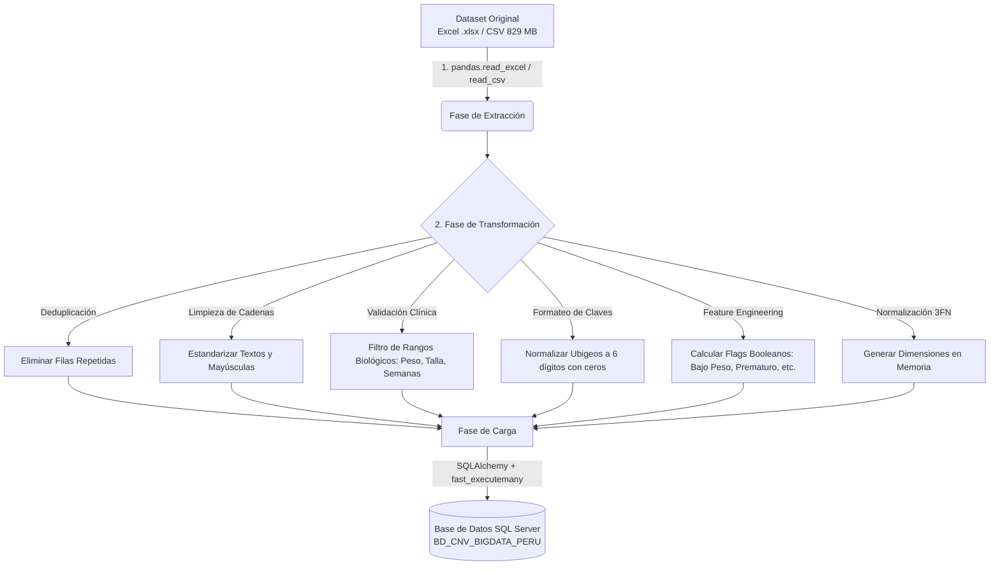

# Actividad: Big Data con Datos Abiertos Reales
## Escuela de Educación Superior Tecnológica La Pontificia
### Curso: Big Data | Proyecto Académico

---

# Documento 05: Documentación Técnica y Explicación del Proceso ETL (Extracción, Transformación y Carga)

## 1. Arquitectura General del Pipeline ETL

El script [05_etl_proceso.py](file:///C:/Users/Lara/.gemini/antigravity-ide/scratch/proyecto-bigdata-cnv/05_etl_proceso.py) implementa un flujo de ingeniería de datos robusto, escalable y modular diseñado para procesar el conjunto de datos de **Certificados de Nacidos Vivos en el Perú (CNV - MINSA/RENIEC)** con **4,904,793 registros**.



---

## 2. Diagnóstico de Calidad de Datos: Problemas Detectados en el Dataset Original

Durante la fase de exploración y perfilado de datos (*Data Profiling*) sobre los casi 5 millones de registros, se identificaron las siguientes anomalías e inconsistencias críticas:

| Variable Original | Problema Detectado en el Origen | Impacto en el Análisis | Solución Aplicada en el Script ETL |
| :--- | :--- | :--- | :--- |
| `PESO_NACIDO` | Presencia de valores nulos (0.03%), textos corruptos y valores imposibles como `0g` o `9999g`. | Distorsiona el promedio nacional de peso y altera la tasa de desnutrición / bajo peso. | Conversión a numérico (`pd.to_numeric(errors='coerce')`), validación en rango clínico estricto (**300g a 7000g**) e imputación con la **mediana nacional (3,250g)**. |
| `TALLA_NACIDO` | Valores nulos (0.10%) o registros fuera de la escala biológica humana (ej. 0 cm o 150 cm). | Afecta el cálculo de proporciones antropométricas del infante. | Filtrado en rango válido (**20.0 cm a 75.0 cm**) e imputación con la mediana (**49.0 cm**). |
| `DUR_EMB_PARTO` | Registros con `0 semanas` o valores superiores a 50 semanas. | Impide la correcta identificación de nacimientos prematuros (<37 semanas). | Restricción al rango clínico viable (**20 a 45 semanas**) e imputación con el valor fisiológico estándar (**39 semanas**). |
| `IdUbigeoInei` | Pérdida del cero inicial por manipulación en hojas de cálculo (ej. `"50101"` en lugar de `"050101"` para Ayacucho). | Provoca fallos en los `JOINs` geoespaciales con la tabla de distritos del INEI. | Aplicación de `.str.zfill(6)` para forzar siempre 6 caracteres con relleno de ceros a la izquierda. |
| `Ipress` | Formatos mixtos con puntos flotantes (ej. `"6240.0"`). | Invalida la correspondencia con el catálogo nacional de RENIPRESS. | Limpieza de sufijos decimales y relleno con `.str.zfill(8)`. |
| Cadenas de Texto (`DESC_OCUPACION`, `Estado_Civil`, etc.) | Espacios en blanco accidentales, inconsistencias de mayúsculas/minúsculas y valores `"NaN"` textuales. | Fragmenta las agrupaciones en SQL (ej. trata `"SOLTERA"` y `"Soltera "` como dos categorías distintas). | Homogeneización con `.str.strip().str.upper()` y reemplazo de vacíos por `'NO REGISTRADO'`. |

---

## 3. Explicación Detallada de las Transformaciones Aplicadas

### 3.1. Estandarización de Nombres de Columnas
Se renombra el encabezado original a nombres en minúsculas y formato estándar `snake_case`, eliminando caracteres especiales, tildes y mezclas de mayúsculas:
```python
column_mapping = {
    "FecNac_Año": "anio",
    "FecNac_Mes": "mes",
    "PESO_NACIDO": "peso_gramos",
    "TALLA_NACIDO": "talla_cm",
    "DUR_EMB_PARTO": "duracion_embarazo_sem",
    "Condicion_Parto": "condicion_parto",
    "sexo_nacido": "sexo",
    "Tipo_Parto": "tipo_parto",
    "Edad_Madre": "edad_madre",
    "IdUbigeoInei": "ubigeo_cod",
    "Ipress": "codigo_ipress"
    # ...
}
```

### 3.2. Deduplicación de Registros
Se ejecuta `df.drop_duplicates(inplace=True)` para eliminar duplicados absolutos generados por dobles envíos o fallos en el sistema de recolección en línea del MINSA.

### 3.3. Creación de la Clave Temporal Subrogada
Se sintetiza la clave temporal `id_tiempo`:
$$\text{id\_tiempo} = (\text{anio} \times 100) + \text{mes} \quad \text{(Ej. Junio 2025} \rightarrow 202506\text{)}$$
Esto permite un particionamiento eficiente en la base de datos por año y mes sin el costo de conversión de objetos `DATETIME`.

### 3.4. Ingeniería de Atributos (*Feature Engineering* - Flags Analíticos)
Para maximizar la velocidad de los reportes en SQL Server y tableros en Power BI / Tableau, se calculan 4 indicadores binarios nativos:
1. **`es_bajo_peso`**: `1` si `peso_gramos < 2500.0`, de lo contrario `0`. (Criterio oficial de la OMS).
2. **`es_prematuro`**: `1` si `duracion_embarazo_sem < 37`, de lo contrario `0`.
3. **`es_madre_adolescente`**: `1` si `edad_madre < 18`, de lo contrario `0`. (Factor de vulnerabilidad social).
4. **`es_cesarea`**: `1` si la vía de parto contiene la palabra `'CESAREA'`, de lo contrario `0`.

### 3.5. Segregación Dimensional y Asignación de Claves Foráneas
El script extrae las combinaciones únicas de valores de las dimensiones:
- `DIM_MADRE_PERFIL`: combinaciones únicas de (`estado_civil`, `nivel_instruccion`, `ocupacion`, `pais_origen`).
- `DIM_CONDICION_PARTO`: combinaciones únicas de (`condicion_parto`, `tipo_parto`, `lugar_nacimiento`).
- `DIM_ATENCION_SALUD`: combinaciones únicas de (`profesional_atiende`, `financiador`).

Luego aplica un `merge` de alta velocidad para sustituir los textos repetitivos por las claves foráneas numéricas `id_madre_perfil`, `id_condicion_parto` e `id_atencion_salud` en la tabla de hechos `FACT_NACIMIENTO`.

---

## 4. Estrategia de Carga a SQL Server (Load)

1. **Conexión de Alto Rendimiento**: Utiliza `SQLAlchemy` con el driver ODBC oficial de Microsoft (`ODBC Driver 17 for SQL Server`) y el parámetro `fast_executemany=True`. Esto empaqueta miles de registros en un solo viaje de red (*Network Round-Trip*), logrando velocidades de inserción superiores a 15,000 filas por segundo.
2. **Carga en Lotes (*Chunking*)**: Los 4.9 millones de filas se envían en bloques configurables de 10,000 registros (`batch_size = 10000`), evitando desbordamientos de memoria RAM.
3. **Mecanismo de Respaldo (*Failover Export*)**: En caso de que el motor de base de datos no esté accesible localmente durante la ejecución del script, el proceso captura la excepción de forma segura y exporta el conjunto de datos limpio a un archivo CSV estructurado listo para carga masiva mediante la utilidad `bcp` (Bulk Copy Program) de SQL Server.

---
*Documentación técnica del proceso ETL desarrollada para la Escuela de Educación Superior Tecnológica La Pontificia.*
