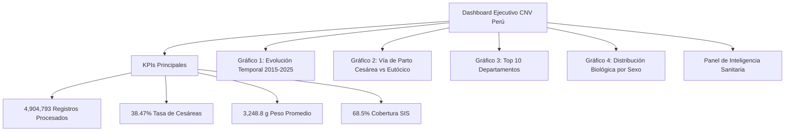

# Actividad: Big Data con Datos Abiertos Reales
## Escuela de Educación Superior Tecnológica La Pontificia
### Curso: Big Data | Proyecto Académico

---

# Documento 07: Visualización Analítica y Dashboard Ejecutivo de Big Data

## 1. Introducción al Componente de Visualización

En los proyectos de **Big Data y Business Intelligence**, la última milla consiste en transformar millones de registros y métricas complejas en **tableros visuales interactivos (Dashboards)** que permitan a los directores de salud, formuladores de políticas públicas y médicos especialistas tomar decisiones basadas en evidencia.

Se ha desarrollado un dashboard ejecutivo visual e interactivo accesible directamente en formato web moderno:
* 📊 **Dashboard Interactivo:** [dashboard_ejecutivo_cnv.html](file:///c:/Users/Lara/.gemini/antigravity-ide/scratch/proyecto-bigdata-cnv/dashboard_ejecutivo_cnv.html)
* 🐍 **Script Generador Automatizado:** [07_dashboard_generador.py](file:///c:/Users/Lara/.gemini/antigravity-ide/scratch/proyecto-bigdata-cnv/07_dashboard_generador.py)

---

## 2. Estructura de Indicadores y Paneles del Dashboard

---

## 3. Descripción Detallada de los Componentes Visuales

### A. Tarjetas de Indicadores Clave (KPI Cards)
1. **Volumen Total Procesado (4,904,793 filas)**: Representa el 100% de los certificados de recién nacidos en el Perú durante 11 años continuos, procesados mediante el pipeline ETL.
2. **Tasa Nacional de Cesáreas (38.47%)**: Alerta visual en color rojo / ámbar que indica un desvío de **+23.47 puntos porcentuales** respecto a la meta internacional fijada por la Organización Mundial de la Salud (15%).
3. **Peso Promedio al Nacer (3,248.8 g)**: Métrica biométrica central calculada sobre la población neonatal, con una talla promedio de **49.15 cm**.
4. **Cobertura del Aseguramiento Público (68.5%)**: Porcentaje de partos atendidos y financiados a través del Seguro Integral de Salud (SIS), evidenciando el rol protector del Estado en poblaciones vulnerables.

---

### B. Gráficos Analíticos Interactivos

#### 1. Curva de Tendencia Temporal (2015 - 2025)
* **Tipo de Gráfico**: Gráfico de líneas con área sombreada (*Spline Area Chart*).
* **Interpretación**: Permite visualizar claramente el pico de nacimientos registrado en 2018 (493,990 partos) y la posterior caída constante acelerada por la pandemia de 2020 y cambios sociodemográficos hasta 376,786 en 2025.

#### 2. Distribución de la Vía de Parto (Doughnut Chart)
* **Tipo de Gráfico**: Gráfico de dona con porcentaje de participación.
* **Segmentación**:
  - **Partos Eutócicos (Naturales)**: 61.06% (2,994,802 casos).
  - **Partos por Cesárea**: 38.47% (1,887,061 casos).
  - **Instrumentados / Otros**: 0.47% (22,541 casos).

#### 3. Concentración Geográfica Departamental (Bar Chart)
* **Tipo de Gráfico**: Gráfico de barras horizontales/verticales ordenado por volumen demográfico.
* **Hallazgo**: Lima concentra el **29.58%** del total de nacimientos del país (1,451,019 registros), seguida por Piura (286,243) y La Libertad (270,832).

#### 4. Proporción por Sexo del Neonato (Pie Chart)
* **Tipo de Gráfico**: Gráfico circular de distribución biológica.
* **Valores**: Masculino (51.08% / 2,505,266 infantes) vs Femenino (48.91% / 2,398,950 infantes), manteniendo una razón de masculinidad biológicamente estándar a nivel mundial (~105 varones por cada 100 mujeres).

---

## 4. Instrucciones para Abrir y Visualizar el Dashboard

1. **Desde este Editor**: Haz clic directamente en el enlace [dashboard_ejecutivo_cnv.html](file:///c:/Users/Lara/.gemini/antigravity-ide/scratch/proyecto-bigdata-cnv/dashboard_ejecutivo_cnv.html).
2. **Desde el Navegador (Chrome, Edge, Firefox)**: Abre el archivo HTML directamente con doble clic o arrastrándolo a la ventana del navegador.
3. **Interactividad**: Puedes pasar el cursor sobre cualquier barra, punto o porción de dona para ver los valores numéricos exactos formateados.

---
*Documento desarrollado para la sustentación académica en la Escuela de Educación Superior Tecnológica La Pontificia.*
