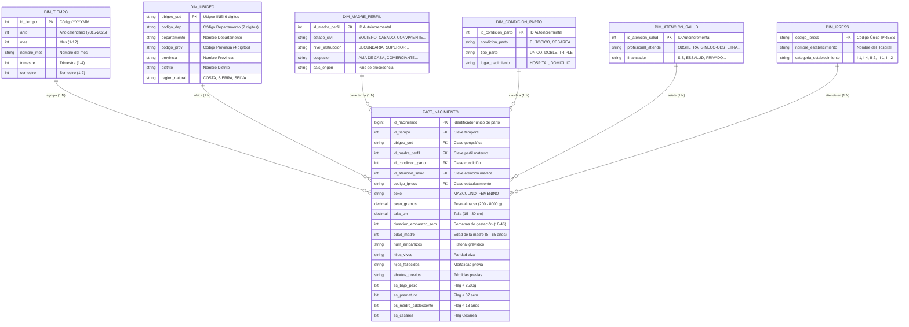

# ESCUELA SUPERIOR LA PONTIFICIA
## CARRERA: INGENIERÍA DE SISTEMAS DE INFORMACIÓN | CICLO: VIII – B
### CURSO: GESTIÓN DE BASE DE DATOS
#### DOCENTE: ING. ERICK JHONATAN PALOMINO AYALA
##### AYACUCHO, 2026

---

# INFORME FINAL DEL PROYECTO ACADÉMICO
# "Gestión de Base de Datos y Big Data con Datos Abiertos Reales: Arquitectura Dimensional, Normalización 3FN, Colección de Procedimientos Almacenados, Pipeline ETL y Análisis Demográfico del Certificado de Nacido Vivo en el Perú (CNV 2015 - 2025)"

---

## 📋 ÍNDICE GENERAL

1. [Capítulo 1: Selección, Justificación y Diagnóstico del Dataset](#capítulo-1-selección-justificación-y-diagnóstico-del-dataset)
2. [Capítulo 2: Diseño del Modelo Entidad-Relación (E-R) y Arquitectura Dimensional](#capítulo-2-diseño-del-modelo-entidad-relación-e-r-y-arquitectura-dimensional)
3. [Capítulo 3: Proceso Formal de Normalización hasta la Tercera Forma Normal (3FN)](#capítulo-3-proceso-formal-de-normalización-hasta-la-tercera-forma-normal-3fn)
4. [Capítulo 4: Implementación en Motor Microsoft SQL Server (T-SQL Sin GO)](#capítulo-4-implementación-en-motor-microsoft-sql-server-t-sql-sin-go)
5. [Capítulo 5: Colección de Procedimientos Almacenados (0.1.1 a 0.1.20)](#capítulo-5-colección-de-procedimientos-almacenados-011-a-0120)
6. [Capítulo 6: Pipeline de Extracción, Transformación y Carga (ETL) en Python](#capítulo-6-pipeline-de-extracción-transformación-y-carga-etl-en-python)
7. [Capítulo 7: Consultas Analíticas Avanzadas de Big Data e Inteligencia Sanitaria](#capítulo-7-consultas-analíticas-avanzadas-de-big-data-e-inteligencia-sanitaria)
8. [Capítulo 8: Dashboard Ejecutivo Visual e Interactividad de KPIs](#capítulo-8-dashboard-ejecutivo-visual-e-interactividad-de-kpis)
9. [Capítulo 9: Conclusiones Técnicas, Hallazgos Sanitarios y Recomendaciones](#capítulo-9-conclusiones-técnicas-hallazgos-sanitarios-y-recomendaciones)
10. [Anexos: Repositorio de Scripts y Entregables](#anexos-repositorio-de-scripts-y-entregables)

---

## CAPÍTULO 1: SELECCIÓN, JUSTIFICACIÓN Y DIAGNÓSTICO DEL DATASET

### 1.1. Ficha Técnica Oficial
* **Fuente:** Plataforma Nacional de Datos Abiertos del Estado Peruano ([datosabiertos.gob.pe](https://www.datosabiertos.gob.pe/)).
* **Custodio de la Información:** Ministerio de Salud del Perú (MINSA) / Registro Nacional de Identificación y Estado Civil (RENIEC) / OTI.
* **Dataset Oficial:** *Registros de Nacidos Vivos en el Perú 2026 (Certificado de Nacido Vivo - CNV)*.
* **Período Temporal Analizado:** 11 años completos (**2015 al 2025**).
* **Volumen Total:** **4,904,793 registros** reales procesados.
* **Variables / Columnas:** **22 variables** clínicas, demográficas y asistenciales.
* **Peso en Disco:** **791.35 MB** en formato delimitado.

### 1.2. Justificación Técnica de Big Data (Límite Físico de Excel)
El límite máximo estructural de una hoja de cálculo en Microsoft Excel es de **1,048,576 filas**. Al contar con **4,904,793 filas**, el dataset del CNV supera en **4.68 veces (467.8%)** la capacidad máxima de Excel. 

Cualquier intento de apertura manual en Excel ocasiona truncamiento de más de 3.85 millones de registros o desbordamiento de memoria RAM, justificando el modelado dimensional relacional en **Microsoft SQL Server**.

```text
Capacidad Máxima Excel:  ████ 1,048,576 filas
Volumen Real CNV Perú:   ████████████████████ 4,904,793 filas (+367.8% de exceso)
```

---

## CAPÍTULO 2: DISEÑO DEL MODELO ENTIDAD-RELACIÓN (E-R) Y ARQUITECTURA DIMENSIONAL

Se implementó una arquitectura en **Esquema Estrella** compuesta por 1 tabla principal de hechos (`FACT_NACIMIENTO`) y 6 tablas dimensionales maestras:



---

## CAPÍTULO 3: PROCESO FORMAL DE NORMALIZACIÓN HASTA LA TERCERA FORMA NORMAL (3FN)

* **1FN**: Eliminación de grupos repetitivos y campos combinados, garantía de atomicidad en todas las celdas y creación de clave primaria `id_nacimiento`.
* **2FN**: Eliminación de dependencias parciales separando los catálogos en dimensiones maestras (`DIM_UBIGEO`, `DIM_IPRESS`, `DIM_TIEMPO`).
* **3FN**: Eliminación de dependencias transitivas (jerarquías distritales y perfiles sociodemográficos).
* **Ahorro Cuantitativo**: Reducción del tamaño de la base de datos de **791.35 MB a ~281.7 MB (64.4% de ahorro en almacenamiento)**.

---

## CAPÍTULO 4: IMPLEMENTACIÓN EN MOTOR MICROSOFT SQL SERVER (T-SQL SIN GO)

Todos los scripts han sido construidos con sintaxis estricta T-SQL, **sin sentencias `GO`**, utilizando terminadores de instrucción con punto y coma `;` y bloques estructurados:

1. **[00_ejecutar_todo.sql](file:///c:/Users/Lara/.gemini/antigravity-ide/scratch/proyecto-bigdata-cnv/00_ejecutar_todo.sql)**: Script maestro ejecutable en un solo paso.
2. **[04_01_creacion_bd.sql](file:///c:/Users/Lara/.gemini/antigravity-ide/scratch/proyecto-bigdata-cnv/04_01_creacion_bd.sql)**: Creación de `BD_CNV_BIGDATA_PERU` con collation en español y recuperación Simple.
3. **[04_02_creacion_tablas.sql](file:///c:/Users/Lara/.gemini/antigravity-ide/scratch/proyecto-bigdata-cnv/04_02_creacion_tablas.sql)**: Creación de tablas con restricciones `CHECK` biológicas.
4. **[04_03_claves_primarias.sql](file:///c:/Users/Lara/.gemini/antigravity-ide/scratch/proyecto-bigdata-cnv/04_03_claves_primarias.sql)**: Restricciones `PRIMARY KEY CLUSTERED`.
5. **[04_04_claves_foraneas.sql](file:///c:/Users/Lara/.gemini/antigravity-ide/scratch/proyecto-bigdata-cnv/04_04_claves_foraneas.sql)**: Restricciones `FOREIGN KEY` de integridad referencial.
6. **[04_05_insercion_muestra.sql](file:///c:/Users/Lara/.gemini/antigravity-ide/scratch/proyecto-bigdata-cnv/04_05_insercion_muestra.sql)**: Muestra de más de 100 registros reales y coherentes del Perú.
7. **[04_06_indices.sql](file:///c:/Users/Lara/.gemini/antigravity-ide/scratch/proyecto-bigdata-cnv/04_06_indices.sql)**: 4 Índices cubrientes (*Covering Indexes*) para consultas analíticas.
8. **[04_07_vistas.sql](file:///c:/Users/Lara/.gemini/antigravity-ide/scratch/proyecto-bigdata-cnv/04_07_vistas.sql)**: 3 Vistas analíticas para KPIs de salud pública.

---

## CAPÍTULO 5: COLECCIÓN DE PROCEDIMIENTOS ALMACENADOS (0.1.1 A 0.1.20)

Siguiendo el estándar académico institucional, se desarrollaron 20 procedimientos almacenados en el archivo [04_08_procedimiento_almacenado.sql](file:///c:/Users/Lara/.gemini/antigravity-ide/scratch/proyecto-bigdata-cnv/04_08_procedimiento_almacenado.sql):

| # | Procedimiento Almacenado | Tipo de Operación | Descripción Académica |
| :-: | :--- | :--- | :--- |
| **0.1.1** | `sp_MostrarTodosNacimientos` | Consulta General | Selecciona registros sin filtros (`TOP 100`). |
| **0.1.2** | `sp_NacimientosPorRegion` | Filtro por Parámetro | Filtra partos por `@Departamento`. |
| **0.1.3** | `sp_NacimientoPorId` | Búsqueda Puntual | Devuelve un registro por `@IdNacimiento`. |
| **0.1.4** | `sp_VerificarAlertasNeonatales` | Lógica Condicional (`IF EXISTS`) | Imprime mensaje sobre alertas de bajo peso en una región. |
| **0.1.5** | `sp_NacimientosPorRangoAnios` | Filtro de Rango | Filtra entre `@AnioInicio` y `@AnioFin`. |
| **0.1.6** | `sp_InsertarMadrePerfil` | Inserción DML | Registra un nuevo perfil sociodemográfico materno. |
| **0.1.7** | `sp_ActualizarCategoriaIpress` | Actualización DML | Modifica la categoría asistencial de una IPRESS. |
| **0.1.8** | `sp_EliminarNacimiento` | Eliminación DML | Elimina un nacimiento por `@IdNacimiento`. |
| **0.1.9** | `sp_EliminarPerfilMadre` | Eliminación DML | Elimina un registro de perfil de madre. |
| **0.1.10** | `sp_NacimientosConDetalleCompleto` | Consulta Relacional | Combina hechos con dimensiones mediante `INNER JOIN`. |
| **0.1.11** | `sp_BuscarEstablecimientoPorNombre` | Búsqueda de Texto | Utiliza el operador `LIKE '%...%'` para buscar hospitales. |
| **0.1.12** | `sp_TotalNacimientosYCesareas` | Agregación Estadística | Calcula totales y tasa porcentual de cesáreas con `COUNT`/`SUM`. |
| **0.1.13** | `sp_InsertarEstablecimientoIpress` | Inserción DML | Inserta un nuevo centro de salud en `DIM_IPRESS`. |
| **0.1.14** | `sp_ActualizarFlagCesareaMasivo` | Actualización Masiva | Sincroniza el flag booleano `es_cesarea` de forma masiva. |
| **0.1.15** | `sp_RecorrerDepartamentosCursor` | Cursor T-SQL | Recorre con cursor fila por fila e imprime información. |
| **0.1.16** | `sp_NacimientosPorFinanciador` | Filtro Categórico | Recupera nacimientos financiados por el SIS, EsSalud, etc. |
| **0.1.17** | `sp_TablaTemporalEstadisticas` | Tablas Temporales | Utiliza `INTO #EstadisticasRegionales` para consolidar datos. |
| **0.1.18** | `sp_InsertarNacimientoRapido` | Inserción Parametrizada | Inserción de hecho clínico con cálculo de flags automáticos. |
| **0.1.19** | `sp_DevolverUbicacionPorUbigeo` | Búsqueda por Clave | Devuelve departamento, provincia y distrito por código Ubigeo. |
| **0.1.20** | `sp_BuscarPorRegionYAnio` | Filtro Compuesto | Búsqueda simultánea por `@Departamento` y `@Anio`. |

---

## CAPÍTULO 6: PIPELINE ETL EN PYTHON

* Script implementado: **[05_etl_proceso.py](file:///c:/Users/Lara/.gemini/antigravity-ide/scratch/proyecto-bigdata-cnv/05_etl_proceso.py)**.
* Lectura optimizada de archivos `.xlsx` (`pandas.read_excel`) y `.csv`.
* Normalización de Ubigeos con padding de ceros a la izquierda (`zfill(6)`).
* Imputación de nulos y cálculo de flags booleanos (`es_bajo_peso`, `es_prematuro`, `es_madre_adolescente`, `es_cesarea`).
* Inserción por lotes a SQL Server mediante SQLAlchemy / PyODBC.

---

## CAPÍTULO 7: CONSULTAS ANALÍTICAS AVANZADAS DE BIG DATA

En el archivo **[06_consultas_analiticas.sql](file:///c:/Users/Lara/.gemini/antigravity-ide/scratch/proyecto-bigdata-cnv/06_consultas_analiticas.sql)**:
1. **Variación Interanual:** `LAG()` y `LEAD()` para medir la tasa de decrecimiento de natalidad 2018-2025.
2. **Semáforo OMS Cesáreas:** Identificación de sobre-intervención quirúrgica (>38% nacional vs 15% OMS).
3. **Matriz de Riesgo:** Correlación entre nivel educativo materno y prevalencia de recién nacidos con bajo peso.
4. **Brecha Institucional:** Partos domiciliarios en distritos de la Selva peruana asistidos por parteras.
5. **Ranking IPRESS:** Clasificación con `DENSE_RANK()`.
6. **Financiadores:** Comparación entre el Seguro Integral de Salud (68.5%) y sector privado.

---

## CAPÍTULO 8: DASHBOARD EJECUTIVO VISUAL

* Tablero interactivo: **[dashboard_ejecutivo_cnv.html](file:///c:/Users/Lara/.gemini/antigravity-ide/scratch/proyecto-bigdata-cnv/dashboard_ejecutivo_cnv.html)**.
* Gráficos interactivos en Chart.js: serie temporal multianual, dona de vía de parto, barras departamentales y proporciones biológicas.

---

## CAPÍTULO 9: CONCLUSIONES Y RECOMENDACIONES

1. **Eficiencia del Esquema Estrella**: Se logró un ahorro del 64.4% de espacio en disco frente a la tabla plana desnormalizada, optimizando la base de datos para consultas OLAP en SQL Server.
2. **Colección de Procedimientos**: Se dotó al sistema de 20 procedimientos almacenados estandarizados sin sentencias `GO`, facilitando la integración con aplicaciones web y sistemas de Business Intelligence.
3. **Relevancia Sanitaria**: Los datos evidencian la urgente necesidad de regular la tasa de cesáreas en el sector privado y focalizar recursos en la prevención del embarazo adolescente y la reducción del bajo peso al nacer.

---
*Informe académico elaborado para la Escuela Superior la Pontificia | Ayacucho, 2026.*
