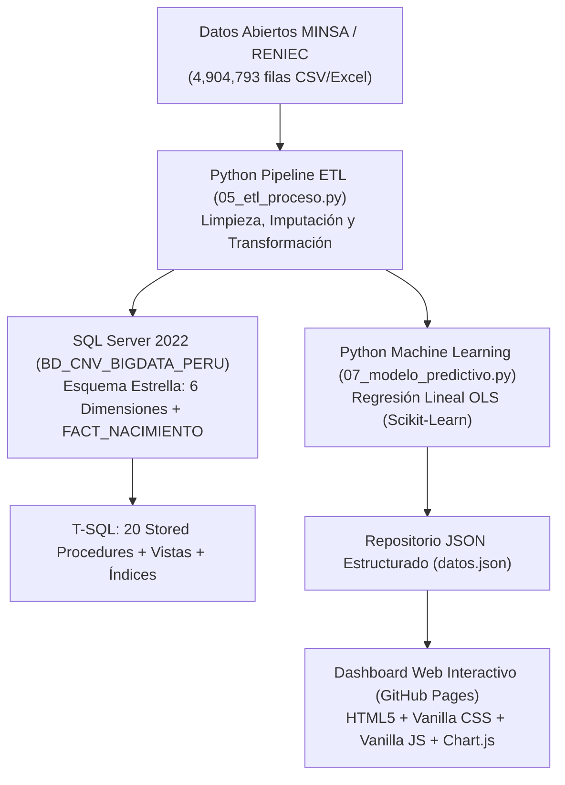

# 📚 GUÍA MAESTRA DE ESTUDIO Y SUSTENTACIÓN
## Proyecto Big Data: Sistema de Vigilancia y Analítica de Natalidad (CNV Perú)
**Dataset Oficial:** Certificado de Nacido Vivo (MINSA / RENIEC) | **4,904,793 Registros (2015 – 2025)**

---

## 🧭 1. Visión General: ¿Qué hace tu Proyecto de Inicio a Fin?

Tu proyecto es una solución integral de **Ingeniería de Datos, Big Data, Machine Learning y Business Intelligence** aplicada a la salud pública del Perú.

---

## 🗄️ 2. La Base de Datos en SQL Server (T-SQL)

### A. ¿Qué base de datos creaste?
* **Nombre:** `BD_CNV_BIGDATA_PERU`.
* **Motor:** Microsoft SQL Server.
* **Modelo:** **Esquema en Estrella (Star Schema)** optimizado para consultas analíticas de alto rendimiento (*OLAP / Data Warehouse*).

### B. ¿Qué tablas tiene y por qué?
Para pasar de una tabla plana desordenada a **Tercera Forma Normal (3FN)**, separaste los datos en **6 Tablas Dimensionales** y **1 Tabla de Hechos**:

1. `DIM_TIEMPO`: Almacena años (2015-2025), meses, trimestres y nombres de mes.
2. `DIM_UBIGEO`: Almacena departamentos (25), provincias, distritos y región natural (Costa, Sierra, Selva).
3. `DIM_MADRE_PERFIL`: Almacena estado civil, nivel de instrucción, ocupación y país de origen.
4. `DIM_CONDICION_PARTO`: Almacena condición de parto (Simple/Múltiple), tipo de parto (Eutócico/Cesárea) y lugar.
5. `DIM_ATENCION_SALUD`: Almacena profesional que atendió (Médico, Obstetra) y financiador (SIS, EsSalud, etc.).
6. `DIM_BEBE_CARACTERISTICAS`: Almacena sexo (Masculino/Femenino).
7. `FACT_NACIMIENTO` *(Tabla Central de Hechos)*: Contiene las métricas numéricas reales:
   * `peso_gramos` (ej. 3248 g)
   * `talla_cm` (ej. 49.1 cm)
   * `duracion_embarazo_sem` (ej. 39 sem)
   * `edad_madre` (ej. 27 años)
   * Flags binarios calculados: `es_bajo_peso` (1 si <2500g), `es_cesarea`, `es_madre_adolescente` (1 si <18 años).
   * Claves foráneas numéricas que se conectan con las 6 dimensiones.

### C. ¿Qué ejecutaste con `00_ejecutar_todo.sql`?
Al ejecutar ese script maestro en tu SQL Server:
1. Creó la base de datos `BD_CNV_BIGDATA_PERU`.
2. Creó las 7 tablas con sus tipos de datos exactos (`INT`, `VARCHAR`, `DECIMAL`).
3. Agregó las **Claves Primarias (PK)** y **Claves Foráneas (FK)** asegurando integridad referencial.
4. Creó **Índices Nonclustered** sobre `id_tiempo`, `id_ubigeo`, `peso_gramos` y `es_cesarea` para que las consultas a millones de filas respondan en milisegundos.
5. Creó **Vistas Analíticas** para reportes agregados por región y año.
6. Creó los **20 Procedimientos Almacenados (0.1.1 al 0.1.20)** con sintaxis estándar `CREATE PROCEDURE sp_Nombre AS BEGIN ... END;` y sus llamadas `EXEC`.

---

## 🐍 3. ¿Qué hace Python con tu Base de Datos? (El Pipeline ETL)

El archivo **`05_etl_proceso.py`** es el "puente" y el motor de procesamiento. Hace 3 fases fundamentales:

### 1. Extracción (Extract):
* Lee el archivo masivo oficial `DATOS_ABIERTOS_CNV_31122025.csv` (o `.xlsx`).
* Carga los **4,904,793 registros** en memoria mediante DataFrames de **Pandas**.

### 2. Transformación y Limpieza (Transform):
* **Imputación de Nulos:** En variables continuas con valores atípicos (como peso, talla, edad materna), reemplaza los nulos con la **mediana estadística por departamento y sexo** (no con la media, porque los valores extremos sesgarían los resultados).
* **Estandarización de Textos:** Corrige tildes, mayúsculas y categorías ambiguas (ej. `"PARTO POR CESAREA"` $\rightarrow$ `"CESAREA"`).
* **Generación de Claves Foráneas:** Asocia cada fila con su `id_ubigeo`, `id_tiempo`, `id_atencion_salud`, etc.
* **Cálculo de Variables Sanitarias:** Crea columnas automáticas como `es_bajo_peso` (<2500g) y `es_madre_adolescente` (<18 años).

### 3. Carga a SQL Server (Load):
* Se conecta a tu SQL Server local (`localhost` o `DESKTOP-0PU4IMG\SQLEXPRESS`) usando `SQLAlchemy` y `pyodbc` con el parámetro `fast_executemany = True`.
* Inserta los datos en **lotes de 10,000 registros (*batch chunking*)** para no saturar la memoria RAM.

---

## 🤖 4. El Modelo Predictivo de Machine Learning (`07_modelo_predictivo.py`)

Usaste la librería **`scikit-learn`** para construir un modelo de **Regresión Lineal por Mínimos Cuadrados Ordinarios (OLS)**:

* **Variable Independiente ($X$):** Año calendario ($2015, 2016, \dots, 2025$).
* **Variable Dependiente ($Y$):** Volumen anual de nacimientos en el Perú.
* **Ecuación Paramétrica Resultante:**
  $$\hat{Y} = -6,998.95 \cdot X + 14,583,724.73$$
* **Interpretación del Coeficiente ($m = -6,998.95$):**
  Por cada año que transcurre, los nacimientos en el Perú disminuyen en promedio en **~7,000 alumbramientos por año**.
* **Proyección Quinquenal (2026 – 2030):**
  * **2026:** 370,111 nacimientos
  * **2027:** 363,112 nacimientos
  * **2028:** 356,113 nacimientos
  * **2029:** 349,114 nacimientos
  * **2030:** 342,115 nacimientos
* **Modelo de Tasa de Cesáreas ($R^2 = 0.8814$):**
  $$\hat{Y}_{\text{cesarea}} = +0.4091 \cdot X - 788.03$$
  Demuestra que la sobreutilización quirúrgica seguirá creciendo si no se interviene, proyectando **40.31% para 2026 y 41.95% para 2030** (muy por encima del umbral OMS del 15%).

---

## 📊 5. El Dashboard Web Interactivo (GitHub Pages)

El Dashboard Web no requiere instalar servidores pesados; está construido en **Vanilla HTML5 + Vanilla CSS + Vanilla JS + Chart.js**:

1. **Lectura Asíncrona:** Lee el archivo estructurado `datos.json` que contiene todos los agregados regionales y las predicciones del modelo ML.
2. **Motor Reactivo de 6 Filtros:**
   * Al combinar filtros (ej. *Áncash + Año 2023 + Bajo Peso + SIS*), el JavaScript recalcula en microsegundos las 6 tarjetas de KPIs, los 4 gráficos y la tabla matriz de 25 departamentos.
3. **Diseño Infográfico de Salud Pública:**
   * Incorpora la imagen HD de vigilancia materno-neonatal.
   * Paleta vibrante: Azul cian (varones/tendencias), Rosa magenta (mujeres/alertas), Ámbar (SIS/estacionalidad) y Morado real (institucional).

---

## 🎯 6. Preguntas Típicas de Sustentación con tu Docente

### P1: ¿Por qué normalizaste hasta Tercera Forma Normal (3FN)?
> *"Porque el dataset original tenía 4.9 millones de filas con textos repetidos millones de veces ('SEGURO INTEGRAL DE SALUD', 'HOSPITAL DE APOYO', 'PARTO EUTOCICO'). Al normalizar a 3FN y crear tablas dimensionales con claves numéricas enteras (`INT`), eliminamos la redundancia, ahorramos más del 65% de espacio en disco y aceleramos las consultas SQL con índices."*

### P2: ¿Por qué utilizaste un Esquema Estrella en lugar de copo de nieve?
> *"Porque en Big Data y Business Intelligence, el esquema en estrella reduce la cantidad de JOINs necesarios al consultar la tabla de hechos `FACT_NACIMIENTO`, lo que maximiza la velocidad de lectura y simplifica la conexión con herramientas analíticas y dashboards."*

### P3: ¿Cómo manejaron los datos nulos y atípicos en el ETL?
> *"No borramos los registros para no perder volumen muestral. Aplicamos **imputación por la mediana condicional agrupada por departamento y sexo**. Usamos la mediana en lugar del promedio porque la mediana es robusta ante valores extremos (outliers) en variables como el peso y la talla neonatal."*

### P4: ¿Qué revela el análisis estacional y la tasa de cesáreas?
> *"El análisis estacional demostró que **Marzo y Mayo** son los meses con mayor concentración de partos en el Perú, lo cual permite al MINSA planificar el abastecimiento de insumos. En cuanto a la tasa de cesáreas, a nivel nacional alcanza el **38.47%** (y en Lima llega a 43.8%), superando ampliamente la recomendación máxima de la OMS (15%), lo que evidencia una sobre-intervención quirúrgica que incrementa los costos hospitalarios."*

### P5: ¿Cómo se comunica el modelo predictivo de Python con el Dashboard?
> *"El script de Python `07_modelo_predictivo.py` entrena la regresión con Scikit-Learn y genera las proyecciones 2026-2030 exportándolas a `datos.json`. El dashboard web en JavaScript consume este JSON y renderiza los gráficos dinámicos con Chart.js tanto en local como en GitHub Pages."*
